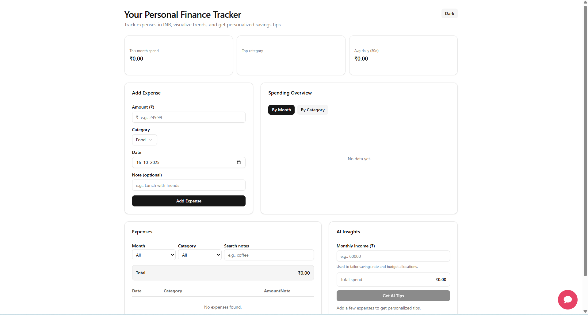

# 💰 FinWise AI — Personalized AI Finance Tracker

[](https://github.com/prajapativikram/Finance-Tracker/stargazers)
[](https://github.com/prajapativikram/Finance-Tracker/network/members)
[](https://github.com/prajapativikram/Finance-Tracker/blob/main/LICENSE)
[](#)

> 🧠 Smartly track, analyze, and plan your finances using Artificial Intelligence.

[🌐 **Live Demo**](https://finance-tracker-one-nu.vercel.app/) • [⭐ **Star this Repo**](#-support) • [🍴 **Fork it**](https://github.com/prajapativikram/Finance-Tracker/fork)

---

## 🧠 Overview

**Finance Tracker With AI Insights** is an **AI-powered personal finance tracker** that helps users manage income, expenses, and savings goals while generating personalized insights using AI.  
It combines automation, smart data visualization, and adaptive learning to create a seamless finance management experience.

---

## 📸 Demo Screenshot

Here’s a quick preview of the FinWise AI Dashboard 👇  



> 💡 *The dashboard shows expense breakdowns, AI insights, and interactive charts for easy analysis.*

---

## ✨ Features

- 🤖 **AI Insights:** Automatically analyze your spending and get personalized recommendations.  
- 💸 **Expense Categorization:** Classify transactions into smart categories.  
- 📊 **Interactive Charts:** Visualize financial trends in real-time.  
- 🎯 **Goal Tracker:** Set savings or investment goals and track progress.  
- 🔗 **n8n AI Integration:** Automate workflows and generate insights.  
- 🔒 **User Auth:** Secure login and session management.  
- 📱 **Responsive Design:** Works smoothly across mobile and desktop devices.

---

## 🧩 Tech Stack

| Layer | Technology |
|:------|:------------|
| **Frontend** | Next.js, React, Tailwind CSS |
| **Backend** | Node.js, Next.js API Routes |
| **Database** | PostgreSQL |
| **AI Engine** | Google AI Studio / Gemini API via n8n |
| **Automation** | n8n Workflows |
| **Charts** | Recharts / Chart.js |
| **Auth** | NextAuth / Firebase |

---

## ⚙️ Installation Guide

### 1️⃣ Fork the Repository
Click → [🍴 **Fork This Repo**](https://github.com/prajapativikram/Finance-Tracker/fork)
Then clone your fork:
```bash
git clone https://github.com/prajapativikram/Finance-Tracker.git
cd Finance-Tracker


2️⃣ Install Dependencies
npm install


3️⃣ Configure Environment Variables
Create a .env.local file in the root directory and add:
NEXT_PUBLIC_API_URL=http://localhost:3000
AI_API_KEY=your_google_ai_key_here
DATABASE_URL=your_postgresql_connection_url
NEXTAUTH_URL=http://localhost:3000
NEXTAUTH_SECRET=your_secret_key_here


4️⃣ Run the Development Server
npm run dev
Open your browser and navigate to http://localhost:3000 to see the app live.

🤖 AI Integration with n8n
Analyze this user's expense data and provide:
- Top spending category
- One-line financial advice
- Suggested monthly savings percentage


🧱 Project Structure
Finance-Tracker/
│
├── public/
│   ├── demo.png           # Dashboard screenshot
│   └── assets/            # Other static assets
│
├── src/
│   ├── components/        # Reusable UI components
│   ├── pages/             # Next.js pages & API routes
│   ├── styles/            # Tailwind/global styles
│   ├── utils/             # Helper functions
│   └── hooks/             # Custom React hooks
│
├── n8n/
│   └── ai-workflow.json   # Example n8n AI workflow
│
└── README.md


💻 Deployment
Deploy on Vercel:

Fork this repository

Go to Vercel
 and import your forked repo

Set environment variables as in .env.local

Click Deploy 🚀

Your live site will be available immediately.
🌐 Live Demo

🧩 Contributing

Contributions are welcome!

Fork the project

Create a new branch (git checkout -b feature-name)

Commit your changes (git commit -m "Add feature")

Push (git push origin feature-name)

Open a Pull Request

Please follow the coding style and ensure features are tested.

🧑‍💻 Author

Vikram Kumar
💼 Software & Frontend Developer | AI & Cloud Enthusiast
🌐 Portfolio : (https://vikram-portfolio-phi.vercel.app/)

🔗 LinkedIn : (https://www.linkedin.com/in/vikram-kumar-0b19a9248/)


This project is licensed under the MIT License — feel free to use, modify, and distribute.

⭐ Support

If you find this project useful, please:

⭐ Star this repository

🍴 Fork it and contribute

💬 Share feedback

“Smarter Finances. Better You.” — FinWise AI


---

This is now a **full, clean, professional, GitHub-ready README**:  

- Supports **forking and contribution**  
- Has **badges for stars, forks, license, status**  
- Includes **live demo, screenshot, and AI workflow explanation**  
- Ready for Vercel deployment  

---

If you want, I can **also add a “Multiple Screenshots / Dashboard Previews” section** in a **grid layout**, which makes the README **super visual** and perfect for showcasing your project on GitHub.  

Do you want me to do that next?


